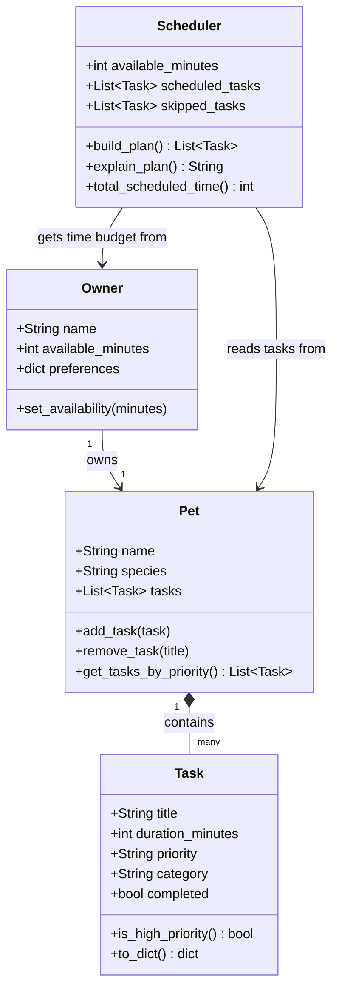

# PawPal+ Project Reflection

## 1. System Design

**a. Initial design**

**Three core user actions:**

1. **Enter owner and pet information.** The user provides basic details about themselves and their pet — such as the pet's name and type, and how much time the owner has available in a day. This context allows the system to personalize the daily plan and respect real-world constraints.

2. **Add and manage care tasks.** The user creates tasks representing things their pet needs (walks, feeding, medication, grooming, enrichment, etc.). Each task has at minimum a duration and a priority level. The user can also edit or remove tasks as the pet's needs change.

3. **Generate and view the daily schedule.** The user requests a daily plan. The system takes the task list and owner constraints, selects and orders tasks that fit within the available time (prioritizing higher-priority tasks), and displays the resulting schedule along with an explanation of why specific tasks were included or excluded.

- Briefly describe your initial UML design.
- What classes did you include, and what responsibilities did you assign to each?

**Object brainstorm:**

**`Task`** — represents a single pet care activity
- Attributes: `title` (str), `duration_minutes` (int), `priority` (str: low/medium/high), `category` (str: walk/feeding/medication/grooming/enrichment), `completed` (bool)
- Methods: `is_high_priority()` → returns True if priority is "high"; `to_dict()` → returns a dictionary representation for display or storage

**`Pet`** — represents the animal being cared for
- Attributes: `name` (str), `species` (str), `tasks` (list of Task)
- Methods: `add_task(task)` → adds a Task to the list; `remove_task(title)` → removes a task by name; `get_tasks_by_priority()` → returns the task list sorted from high to low priority

**`Scheduler`** — the core planning engine that builds the daily schedule
- Attributes: `pet` (Pet), `available_minutes` (int), `scheduled_tasks` (list of Task), `skipped_tasks` (list of Task)
- Methods: `build_plan()` → selects and orders tasks that fit within available time, prioritizing higher-priority items; `explain_plan()` → returns a human-readable string explaining which tasks were included and why others were skipped; `total_scheduled_time()` → returns the sum of durations of all scheduled tasks

**`Owner`** — holds context about the person providing care
- Attributes: `name` (str), `available_minutes` (int), `preferences` (dict, e.g. preferred walk time)
- Methods: `set_availability(minutes)` → updates how much time the owner has in a day

The `Scheduler` depends on both `Owner` (for the time constraint) and `Pet` (for the task list). `Pet` owns a collection of `Task` objects.

**UML Class Diagram:**

**b. Design changes**

- Did your design change during implementation?
- If yes, describe at least one change and why you made it.

---

## 2. Scheduling Logic and Tradeoffs

**a. Constraints and priorities**

- What constraints does your scheduler consider (for example: time, priority, preferences)?
- How did you decide which constraints mattered most?

**b. Tradeoffs**

- Describe one tradeoff your scheduler makes.
- Why is that tradeoff reasonable for this scenario?

---

## 3. AI Collaboration

**a. How you used AI**

- How did you use AI tools during this project (for example: design brainstorming, debugging, refactoring)?
- What kinds of prompts or questions were most helpful?

**b. Judgment and verification**

- Describe one moment where you did not accept an AI suggestion as-is.
- How did you evaluate or verify what the AI suggested?

---

## 4. Testing and Verification

**a. What you tested**

- What behaviors did you test?
- Why were these tests important?

**b. Confidence**

- How confident are you that your scheduler works correctly?
- What edge cases would you test next if you had more time?

---

## 5. Reflection

**a. What went well**

- What part of this project are you most satisfied with?

**b. What you would improve**

- If you had another iteration, what would you improve or redesign?

**c. Key takeaway**

- What is one important thing you learned about designing systems or working with AI on this project?
