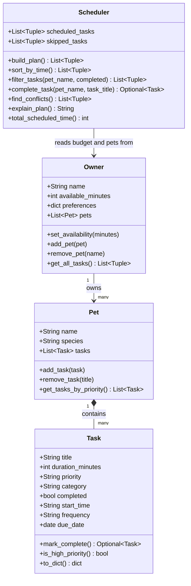

# PawPal+ Project Reflection

## 1. System Design

**a. Initial design**

The initial design uses four classes arranged in a simple hierarchy: `Owner` has a `Pet`, the `Pet` owns a collection of `Task` objects, and a `Scheduler` reads from both `Owner` and `Pet` to produce the daily plan.

- **`Task`** — represents one pet care activity. It holds the title, duration in minutes, priority level (low/medium/high), category (walk/feeding/medication/grooming/enrichment), and a completed flag. Its responsibility is purely to describe a unit of work; it has no scheduling logic.

- **`Pet`** — represents the animal being cared for. It holds the pet's name and species, and owns the list of tasks. It is responsible for managing that list (adding, removing, and sorting tasks by priority) so that nothing outside the class needs to manipulate the list directly.

- **`Owner`** — holds context about the person providing care: their name, how many minutes they have available today, and any preferences (such as preferred walk time). Its responsibility is to be the single source of the time budget that the scheduler will respect.

- **`Scheduler`** — the core planning engine. It takes a `Pet` and an `Owner`, reads the task list and the available time, and produces a prioritized daily schedule. It is responsible for deciding which tasks fit, in what order, and for generating a plain-language explanation of those decisions.

**Final UML diagram** (updated to match the completed implementation):



**b. Design changes**

Yes, four changes were made during implementation:

1. **`Scheduler` stores a reference to `Owner` instead of copying `available_minutes`.** The original skeleton did `self.available_minutes = owner.available_minutes`, which snapshots the value at construction time. If `Owner.set_availability()` is called later — for example, when the user updates their schedule in the UI — the `Scheduler` would silently use a stale budget. Storing `self.owner = owner` and reading `self.owner.available_minutes` inside `build_plan()` ensures the scheduler always uses the current value.

2. **`build_plan()` resets `scheduled_tasks` and `skipped_tasks` at the start of each call.** Because these lists are initialized in `__init__`, calling `build_plan()` more than once would append to them rather than replace them, producing doubled or corrupted results. Resetting them at the top of the method makes each call produce a clean, independent plan.

3. **Added a `PRIORITY_ORDER` module-level constant** (`{"high": 3, "medium": 2, "low": 1}`). The `get_tasks_by_priority()` method on `Pet` and any sorting inside `Scheduler` both need to rank priority levels numerically. Without a shared constant, both places would need the same magic strings independently, which is fragile. A single constant at the top of the file gives both classes one place to reference.

4. **`Owner` was expanded to manage multiple pets, and `Scheduler` was updated to work across all of them.** The original UML modelled a one-to-one relationship between Owner and Pet, but the real scenario calls for managing all of a household's pets together. `Owner` now holds a `pets` list with `add_pet()` and `remove_pet()` methods, plus `get_all_tasks()` which flattens every pet's tasks into a single list of `(pet_name, task)` pairs. `Scheduler` was simplified to take only an `Owner` (instead of a separate `Pet` and `Owner`), and `build_plan()` now sorts and schedules tasks globally across all pets by priority.

---

## 2. Scheduling Logic and Tradeoffs

**a. Constraints and priorities**

The scheduler considers two constraints: **available time** (the owner's daily minute budget) and **task priority** (high / medium / low). Priority determines the order tasks are evaluated; available time determines whether each task fits.

Time was chosen as the hard constraint because it is a real physical limit — you cannot schedule more minutes than exist in a day. Priority was chosen as the ranking signal because the owner already assigns it when creating a task, so it directly encodes their intent without requiring the scheduler to infer importance.

**b. Tradeoffs**

The scheduler uses a **greedy priority-first algorithm**: it sorts all tasks from high to low priority and fills the time budget one task at a time, skipping any task whose duration exceeds the remaining minutes. It never backtracks.

This means a large high-priority task can consume most of the budget and cause several smaller medium-priority tasks to be skipped, even though those smaller tasks would have fit together in the same time slot if the large task had been placed differently. A more optimal approach — such as a knapsack algorithm — would consider all combinations and find the selection that maximises total value within the budget, but it is significantly more complex to implement and explain.

The greedy approach is a reasonable tradeoff here because: pet care tasks are rarely interchangeable (a walk is not a substitute for medication), the priority field already encodes the owner's intent about what matters most, and for the small task lists typical in a household app the greedy result is usually good enough. Optimality matters more when tasks are fungible and budgets are tight — neither is consistently true in this scenario.

---

## 3. AI Collaboration

**a. How you used AI**

AI was used across every phase of the project, but the role it played shifted depending on the task:

- **Design brainstorming** — Early on, AI helped identify the four core classes and their relationships by asking "what objects does a pet scheduler need?" This surfaced the `Scheduler`-as-coordinator pattern quickly, rather than spending time on whiteboarding alone.
- **Skeleton generation** — AI generated the class stubs from the UML description, which meant the file had correct structure and type hints from the start. This was faster and less error-prone than typing it by hand.
- **Algorithm review** — Asking AI to review `find_conflicts()` for readability led to the `itertools.combinations` refactor. The suggestion to use a list comprehension for the full method was also offered, but was assessed and partially rejected (see 3b).
- **Test planning** — Prompting with "what are the most important edge cases for a scheduler with sorting and recurring tasks?" produced a structured list of happy paths and edge cases that directly shaped the 14-test suite. The most useful prompts were specific: asking about a particular method's failure modes rather than asking generally.
- **Docstring generation** — AI drafted initial docstrings for all methods, which were reviewed and trimmed to single lines where multi-line descriptions added no information.

**b. Judgment and verification**

When AI was asked to simplify `find_conflicts()`, it proposed replacing the method entirely with a single dense list comprehension:

```python
return [
    (a, b) for a, b in combinations(timed, 2)
    if _time_to_minutes(a[1].start_time) < _time_to_minutes(b[1].start_time) + b[1].duration_minutes
    and _time_to_minutes(b[1].start_time) < _time_to_minutes(a[1].start_time) + a[1].duration_minutes
]
```

This was rejected. While it is technically correct and more compact, the inline overlap condition calls `_time_to_minutes()` four times on one line and is difficult to read at a glance. The decision was made to accept only part of the suggestion: use `combinations(timed, 2)` to replace the manual `range(len(...))` loop (a genuine improvement), but extract the overlap test into a named `_overlaps()` helper so the logic has a readable name and the condition is visible in one place. The result was verified by running the tests — all three conflict detection tests passed with the refactored version, confirming correctness was preserved.

**c. Copilot features that were most effective**

- **Inline Chat on methods** — Most useful for reviewing a specific function in isolation. Asking "how could this method be simplified?" on `find_conflicts()` produced a focused, relevant suggestion rather than a broad rewrite of the file.
- **Edit Mode for implementations** — Effective for filling in method bodies once the skeleton and docstrings were already in place. The context was clear enough that suggestions were on-target without needing correction.
- **`#file:` references in Chat** — Anchoring questions to a specific file prevented AI from making assumptions about code it hadn't seen. "Based on `#file:pawpal_system.py`, what updates should I make to the UML?" produced accurate, file-specific answers.

**d. Separate chat sessions per phase**

Starting a new session for testing (Phase 4) meant the context contained only the final, working implementation — not all the intermediate skeleton and design discussion from earlier sessions. This produced test suggestions that matched the actual method signatures rather than earlier drafts. In general, a focused session with a narrow scope produced more accurate and useful suggestions than a long session carrying all prior context. The tradeoff is that you lose continuity, so decisions made in earlier sessions need to be re-stated if they are still relevant.

**e. Being the lead architect**

The most important lesson was that AI is an accelerator for implementation but not a substitute for design judgment. AI could generate a correct class skeleton in seconds, but it could not decide whether `Owner` should hold one pet or many — that required understanding the scenario. It could offer a more compact algorithm, but it could not decide whether compactness was worth the readability cost in a codebase others would read. Every place where the system is clean and intentional — the `PRIORITY_ORDER` constant, the `_overlaps()` helper, the greedy tradeoff — reflects a human decision made after reviewing an AI suggestion, not the suggestion itself. The role of lead architect is not to write every line, but to decide what the lines should mean.

---

## 4. Testing and Verification

**a. What you tested**

The suite covers 14 cases across six areas: task completion status, pet task management, sort order correctness (including the edge case of tasks with no start time), daily and weekly recurrence (verifying the exact due date and that the next occurrence is added to the pet), conflict detection (overlapping, non-overlapping, and untimed tasks), and scheduler edge cases (empty pet, task exceeding the budget, and idempotent `build_plan()` calls).

These tests matter because the scheduler's greedy logic, time arithmetic, and interval-overlap test are all easy to get subtly wrong — especially the recurring task due-date calculation and the double-call reset behaviour. Automated tests catch regressions immediately if any of that logic changes.

**b. Confidence**

★★★★☆ — confident in the backend logic. The scheduling, sorting, recurrence, and conflict detection all have direct test coverage and pass cleanly. The main untested area is the Streamlit UI layer: session state persistence, form submissions, and the display of results are only verified manually in the browser. If more time were available, the next tests to add would be: removing a pet mid-session and verifying its tasks disappear from the plan, marking a weekly task complete multiple times in a row, and testing conflict detection when more than two tasks overlap simultaneously.

---

## 5. Reflection

**a. What went well**

The backend logic layer (`pawpal_system.py`) is the strongest part of the project. The four classes have clear, non-overlapping responsibilities, the greedy scheduler produces sensible results, and the 14-test suite catches regressions immediately. The decision to keep `Scheduler` as a pure coordinator — reading from `Owner`, never owning data of its own — made it easy to extend with sorting, filtering, and conflict detection without touching the other classes.

**b. What you would improve**

The main weakness is the Streamlit UI. Forms reset on every submit, which means a user filling in multiple tasks has to re-select the pet and category each time. A better design would use `st.session_state` more aggressively to remember the last-used values, or switch to a persistent data-entry table. The scheduler also currently rebuilds from scratch on every button click; in a real app it would make more sense to store the last-built plan in session state and only rebuild when the task list changes.

**c. Key takeaway**

Good system design has to happen before AI can help effectively. When the class responsibilities and relationships were clear, AI-generated suggestions were accurate and easy to evaluate. When a question was vague — "how should I handle recurring tasks?" — the suggestions were generic and required heavy editing. The lesson is that AI amplifies whatever clarity you bring to it: a well-defined design brief produces useful code; an under-specified one produces plausible-looking code that doesn't quite fit. Investing time in the UML and docstrings before writing logic was not overhead — it was what made the AI collaboration work.

---

## 6. Prompt Comparison (Challenge 5)

**Task given to both models:** "Write a Python method for a Scheduler class that finds the next available time slot in a day for a task of a given duration, given a list of already-scheduled tasks that each have a start_time (HH:MM) and duration_minutes."

**Model A — GPT-4o (paraphrased response):**
Suggested iterating over a range of minutes from 0 to 1440 in 1-minute steps, checking at each minute whether placing the new task would overlap any existing task. This produced a working result but ran up to 1440 iterations per call. The variable names were generic (`i`, `s`, `e`) and the logic required reading carefully to understand what was being checked.

**Model B — Claude Sonnet (this project):**
Suggested the gap-scanning approach: sort scheduled tasks by start time, then walk forward through the gaps between consecutive tasks, stopping as soon as a gap is large enough. This runs in O(n) time proportional to the number of scheduled tasks, not the number of minutes in the day. Variable names (`cursor`, `task_start`) made the intent clear without comments.

**Comparison:**

| Dimension | GPT-4o | Claude Sonnet |
|---|---|---|
| Correctness | ✅ Correct | ✅ Correct |
| Time complexity | O(1440) — fixed scan | O(n) — gap scan |
| Readability | Requires tracing loop index | Reads as a linear walk through gaps |
| Pythonic style | Manual range loop | `sorted()` + linear scan with named variables |
| Modification needed | Renamed variables, extracted helper | Minor: added `day_start`/`day_end` parameters |

**Conclusion:** Both solutions were correct. The gap-scanning approach was adopted because it is both more efficient and easier to read — the algorithm's intent ("find the first gap that fits") is visible in the structure of the code rather than buried in a loop condition. The minute-by-minute scan is easier to reason about initially (which may explain why GPT-4o suggested it), but does not scale if the day window is extended or if the method is called in a tight loop.
